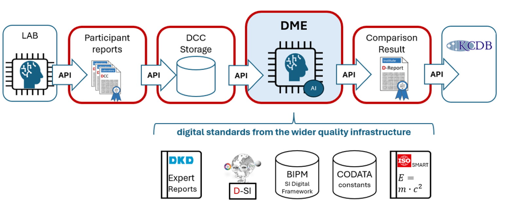
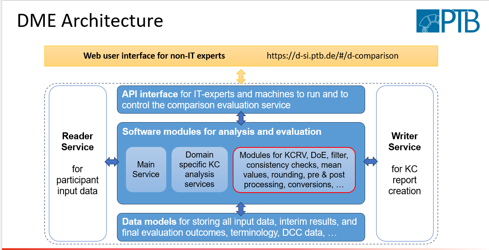

# DME_Backend
- [Overview](#overview)
- [DME Architecture](#DME_Architecture)
- [Prerequisites](#prerequisites)
- [Getting Started](#getting-started)
- [Running the Application](#running-the-application)
- [Docker Setup](#docker-setup)
- [License](#license)

## Overview

The application consists of multiple services:
- **The DME concept**: defines an autonomous operating software with the ability of performing data and result processing as requested for standard work by human metrology experts.
- **DMEs**: are provided for standard work such as evaluation of intercomparison, calculation of model based measurands and quantities, verification of metrological data, etc. They can take over larger amount of tedious human work.
- **StandardBilateralEnCalculationService**: Implements logic for calculating `|Xi - Xj| / sqrt(Ui² - Uj²)`.
- **EnValueCalculationService**: Calculates En-values for various participants.
- **ReferenceValueCalculationService**: Calculates reference values from participant measurements.
- **EnCriterionConsistencyCheckService**: Performs checks to identify if data comparisons are consistent or inconsistent.
- **DecisionProcessingService**: Defines the logic for processing decisions, either manually or automatically.


  

## DME_Architecture

 

This [presentation](src/main/resources/static/docs/CIM2025.pptx) explains the details of the Digital Metrological Expert software tool.

## Prerequisites

- Java 17
- Maven 3.6+
- Docker 

## Getting Started

1. **Clone the repository:**

```bash
git clone https://github.com/PTB-M4D/DME_Backend.git
```
2. **local:**
   Add a local ./m2/settings.xml to allow maven to use the proxy server:

```xml

<settings xmlns="http://maven.apache.org/SETTINGS/1.0.0"
          xmlns:xsi="http://www.w3.org/2001/XMLSchema-instance"
          xsi:schemaLocation="http://maven.apache.org/SETTINGS/1.0.0
                          https://maven.apache.org/xsd/settings-1.0.0.xsd">
  <proxies>
    <proxy>
      <id>.....webproxy</id>
      <active>true</active>
      <protocol>http</protocol>
      <host>webproxy.example.com</host>
      <port>8080</port>
      <nonProxyHosts>localhost|*.example.com</nonProxyHosts>
    </proxy>
  </proxies>
</settings>
```
3. **Build the project local using Maven:**

```bash
mvn clean install
```

4. **Run the application:**

```bash
mvn spring-boot:run
```

## Running the Application

Once the application is running, you can access the API endpoints via `http://localhost:8080/api/dme-comparison/sayHello`.

## Docker Setup

To run the application inside a Docker container, follow these steps:

1. **Build the Docker image:**
```bash

docker build .
```
 
```bash

docker build -t dmebackend  

```


2. **Run the Docker container:**

```bash  
docker run -p 8000:8080 dmebackend
```

The application should now be accessible at `http://localhost:8000/api/dme-comparison/testDme`.

## License

This project is licensed under the MIT License - see the [LICENSE](LICENSE) file for details.


